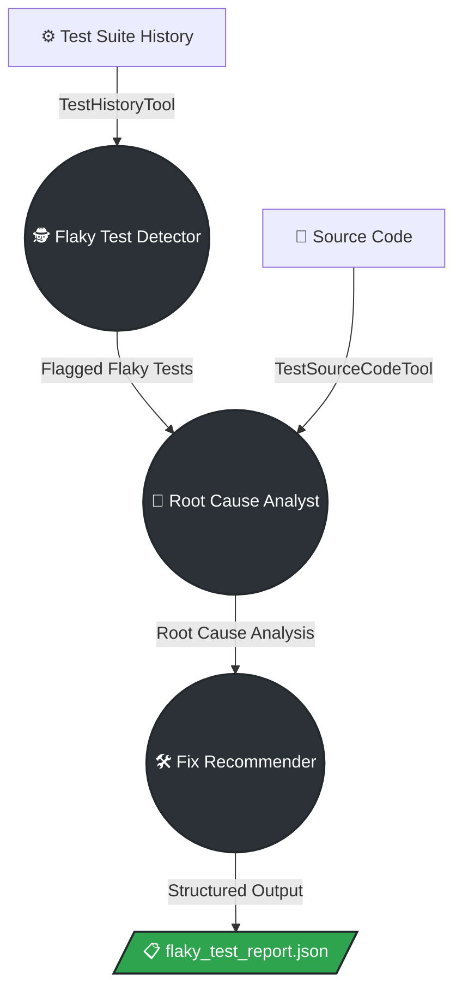

# Flaky Test Investigator CrewAI 🔍🤖

An intelligent, multi-agent CrewAI system designed to detect, analyze, and recommend fixes for flaky tests in your automation test suite.

## 📖 Overview

Flaky tests (tests that pass and fail intermittently without code changes) kill CI/CD trust. This project uses a coordinated team of AI agents powered by LLMs to automatically spot flakiness, read the test's source code, pinpoint the root cause (e.g. race conditions, hard-coded sleeps, shared state), and recommend actionable fixes.

### The AI Crew

This project utilizes a sequential CrewAI process consisting of 3 specialized AI Agents:
1. **Flaky Test Detector:** Analyzes the pass/fail history of the test suite using the `TestHistoryTool` and calculates the flakiness rate.
2. **Root Cause Analyst:** Takes the flagged flaky tests, fetches their exact code using the `TestSourceCodeTool`, and reads the code to identify anti-patterns (like `time.sleep()`, threading issues, etc.).
3. **Fix Recommender:** Synthesizes the data into a final, structured JSON report detailing the cause, the recommended fix, and a decision on whether the test should be immediately quarantined.

### 🔄 Agent Workflow Diagram



---

## 🚀 Setup & Installation

**Note:** CrewAI requires Python `>=3.10` and `<3.14`. This project uses `uv` to manage a compatible Python 3.13 virtual environment.

### 1. Prerequisites
- Install [Python](https://www.python.org/)
- Install `uv` (a fast Python package installer and resolver):
  ```bash
  pip install uv
  ```

### 2. Clone the Repository
```bash
git clone https://github.com/AkshayParab1605/flaky-test-investigator-crewAI.git
cd flaky-test-investigator-crewAI
```

### 3. Create the Virtual Environment & Install Dependencies
Create a Python 3.13 virtual environment and install the required packages:
```bash
uv venv --python 3.13 .venv
uv pip install crewai 'crewai[tools]' litellm pytest python-dotenv pydantic
```

### 4. Configure Environment Variables
1. Open the `.env` file (or create one if it doesn't exist).
2. Set your Groq API key:
   ```env
   GROQ_API_KEY=gsk_your_actual_api_key_here
   ```

---

## 🏃‍♂️ Running the Project

### Running the AI Crew
To start the multi-agent investigation, make sure you are using the virtual environment's python, and run `main.py`:

```bash
# On Windows
.venv\Scripts\python.exe main.py

# On Mac/Linux
.venv/bin/python main.py
```
*The crew will start their tasks, printing their thought process to the console. Once finished, a detailed final structured report will be saved to `flaky_test_report.json`.*

### Running the Test Suite
This project comes with a comprehensive suite of 30 `pytest` tests validating the Custom Tools, Pydantic Models, Agents, and Crew configurations.

```bash
# On Windows
.venv\Scripts\python.exe -m pytest test_crew.py -v

# On Mac/Linux
.venv/bin/python -m pytest test_crew.py -v
```

---

## 📁 Project Structure

- **`main.py`** - Maps out the Agents, Tasks, and Crew execution sequence.
- **`tools/custom_tools.py`** - Defines the `TestHistoryTool` (mocks test history data) and `TestSourceCodeTool` (fetches code strings).
- **`models.py`** - Pydantic models enforcing structured JSON outputs.
- **`test_crew.py`** - Pytest suite asserting that the Crew and tools work as expected.
- **`flaky_test_report.json`** - The final artifact output generated by the Fix Recommender agent.